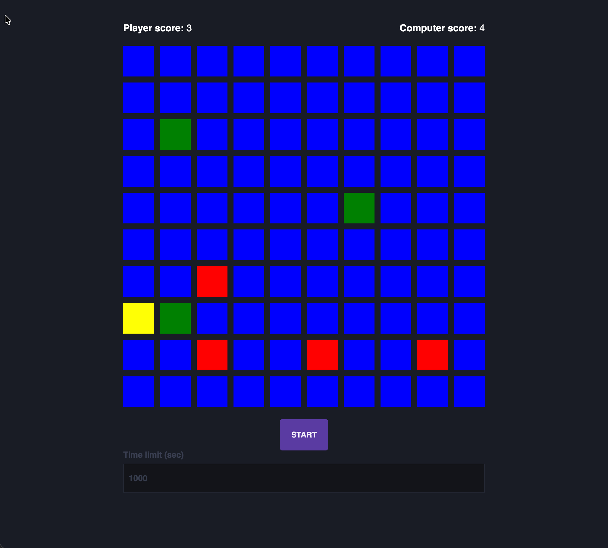

# Test task for Comp..... company

This project is the test task for Comp..... company for Angular Developer position.

## Description of the task

Create a simple mini-game in Angular where the player tries to click by active cell. A user gets one point if he clicks on a yellow cell. Computer gets point if user doesn't click on active cell. The game ends when the player or computer gets 10 points. Before start user can change time until a yellow cell appears.

## Development information

This project was by Angular (version 17.3.17). Recommended version of Node.js is ^18.13.0 (v22.14.0 was used by development).

There were implemented Eslint, Prettier and Husky as basic tools setup for all my projects.

## Starting

You can clone the project by link: https://github.com/BondarevSergey/comparus-test-task.git
After cloning run `npm install` to install all dependencies.

## Development server

Run `ng serve` for a dev server. Navigate to `http://localhost:4200/`. The application will automatically reload if you change any of the source files.

## Build

Run `ng build` to build the project. The build artifacts will be stored in the `dist/` directory.
